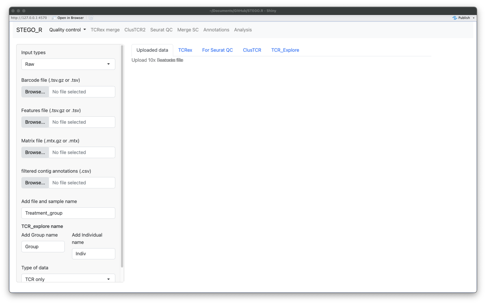
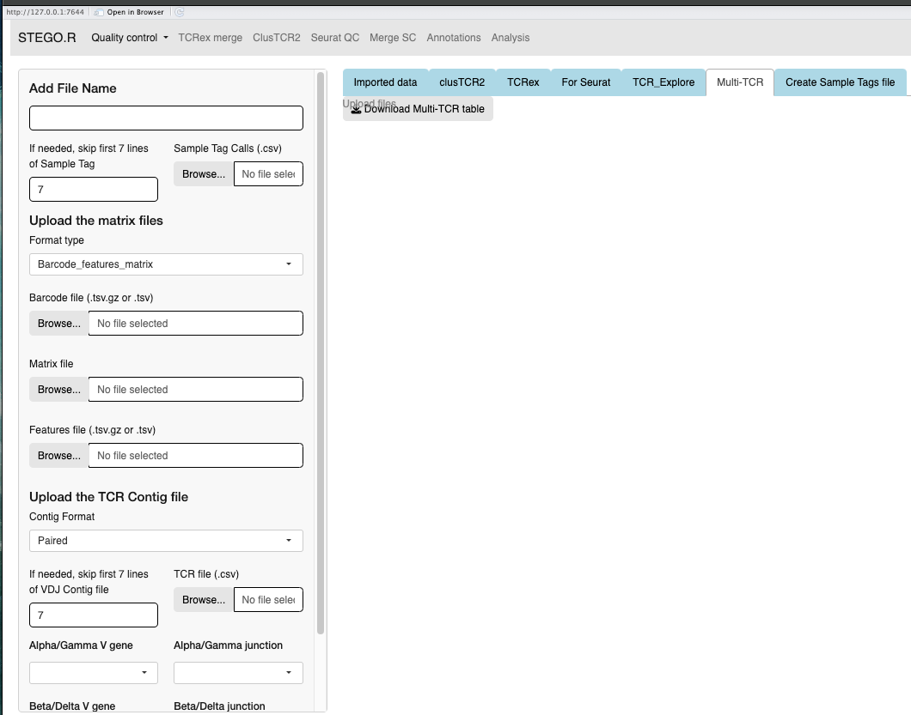

Quality control

.. note:: 
    Consideration for the analysis.  
       The pipeline was built for scRNA-seq with scTCR-seq datasets. 

       QC documentation is being actively updated. 

Prerequisite
------------

Install STEGO. 

Copy all your raw files to the 0_Raw_files folder within your project. 

STEP 1. Formatting
~~~~~~~~~~~~~~~~~~

Formatting the 10x Genomics, BD Rhapsody or Array to create the necessary documents for Seurat QC process, ClusTCR2, TCRex and TCR_Explore.

While this process was initially developed for TCR-seq, we have also included the capacity for pairing the BCR sequences. 

**10x Genomics**

There are several files formats that are compatible with STEGO.R QC process. This includes the standard cell ranger output of barcode, features, matrix files as well as the separate contig file. If the formatting is already in the cellxgene (.csv.gz or .h5 file), then this file format can be uploaded to thet "Seruat QC" section. Upload all the required files. 

*Under development: multi-TCR (requires unfiltered contig file)*

**BD Rhapsody**

There are two format outputs of BD Rhapsody aligment of either a cellxgene (.csv.gz) or the barcode, features and matrix file. Unlike the 10x Genomics, there is also an extra file called "Sample Tags", which contains the multi-plex ID names. The **"Sample Tags"** file is required. However, if some this file is not created (one sample in the experimet), it can be created under the "Create Sample Tags file". 

Additionally there are several formats for the TCR contig file: paired dominant, AIRR dominant (unpaired), AIRR unfilted. For the latter two file formates we include to filter to keep only the 'paired' and if BCR was present as well. 

**Array**

*Note: The TCR_Explore file is for the interrogation of the TCR repertoire independent of the gene expression data at the 

* Install `R <https://cran.r-project.org/bin/macosx/>`_ 

`TCR_Explore <https://tcr-explore.erc.monash.edu/>`_
website*

### Recommended process

Upload the documents to the required sections depending on the technological and files available. Repeat for each of the samples within your project.

1. Check that the files have upload
2. Add **File Name**, this will be added to the 'orig.ident' and "Sample_Name"
      - (10x Genomics and Array, as this is added from the "Sample Tags" in BD Rhapsody) column and used through out the process. This name needs to be unqiue to the file.
      - If, at a latter point it needs to be updated, this can be done with the "Updated_label.csv", located in 3_Analysis folder
3. Download the TCRex (functional Beta chains) to "1_TCRex" folder
4. Download both the "meta-data" and "Matrix" in the SeuratQC into the "1_SeuratQC" folder
5. Two files need to be downloaded per sample under the "ClusTCR" to the "1_ClusTCR" folder. They will have the prefix of AG_ and BD_ (*Version 1.5*)
6. Download the TCR_Explore file "1_TCR_Explore" folder

**STEP 2.** ClusTCR2 and TCRex
~~~~~~~~~~~~~~~~~~~~~~~~~~~~~~~

**Merging TCRex**

1. Upload all the files stored in the "1_TCRex" for merging and download save the merged file to the 1_TCRex. 
2. The TCRex merge file will be uploaded to the `TCRex <https://tcrex.biodatamining.be>_` website to predict if the beta chain will interact with certain epitopes.
3. Once the TCRex process is complete, download the processed file, and move it to the **3_Analysis** folder

.. image:: img/MergeCluster.png
  :width: 300
  :alt: Alternative text

**Clustering with ClusTCR2**

1. If there are multiple files under the 'ClusTCR2', the user will upload all the **AG_** or **BD_** from the **1_ClusTCR2** folder.
      - save the file with **AG_** or **BD_** prefix.

2. Upload either the merged file or single **AG_** or **BD_** under the "Clustering inputs" tab.
3. Hit the "Update clustering" button to perform the clustering. 

4. Under the "output" tab has three sub-sections
      - Processing: Time taken to complete the clustering
      - Table for analysis: Download the table to the "3_Analysis" section; make sure you add the **AG_** or **BD_** prefix to the file name.
      - Figures: There use can explore the data and download the clutering network and the corresponding motif. The latter figure is also generated in the "Analysis section".  

## **STEP 3** Quality control of one Seurat object and adding the TCR pairing information. 

This section describes the Seurat QC process for human samples with 10x Genomics. I use the S133 sample from GES145370 dataset for the example screen shots. 

1. Upload both the meta-data.csv file and the matrix file (.csv.gz, .csv or .h5). 
2. Add the file name, which will be identical to the previous file name.
3. Select the data origin, as it will change the cut-off settings.
      - 10x Genomics >6000 features (transcripts per cell), are deemed to be doublets.
      - BD Rhapsody Immune panel > 150 features, are deemed to be doublets.

4.   Check that the file was uploaded
5.   Look at the first volcano plot "before" tab, as we need to check the cut-off for the MtDNA and rDNA cut-offs
      - MtDNA standard cut-off less than 20%
      - rRNA standard cut-off is greater than 5%. If there is no rRNA genes identifed, set value to 0 or the program will crash due to no cell's remaining.

.. image:: img/BeforeVolc.png
  :width: 600
  :alt: Alternative text

6. Once the settings are hit update and this will add the File name.
7. The user can then inspect the presence of the top variable features, elbow plot and Heatmaps. The latter two plots are to aid in setting the number of dimentions to use for the UMAP dimentional reduction. Default is set to 15. The resolutions are used for the unsupervised clustering. *note: I use the scGate for the annotation stratergy rather than the unsupervised clusters as it is not suitable for identifying subtle differences in T cell sub-populations.*

.. image:: img/ElbowPlot.png
  :width: 600
  :alt: Alternative text

8. In the side panel, hit the "Run clustering" button to run the dimentional reduction.
9. In the "Add meta data", first check that the file has uploaded correctly.
10. Next, In the side panel hit the "Imput metatdata after clustering"
      - This will render a new table, and check that there are TCR present. 
11. Now your file has completed the seurat QC and has had the TCR sequences added to the meta-data. click the "Download Seurat" object and save it to the "2_SCobj" folder.
 
**STEP 4** Merging multiple Seurat objects 
~~~~~~~~~~~~~~~~~~~~~~~~~~~~~~~~~~~~~~~~~~

**STEP 5** Annotating the Seurat object
~~~~~~~~~~~~~~~~~~~~~~~~~~~~~~~~~~~~~~~
[X] 10X Genomics for human
[ ] 10X Genomcis for Mouse
[X] BD Rhapsody Human immune panel
[ ] BD Rhapsody Mouse
               

