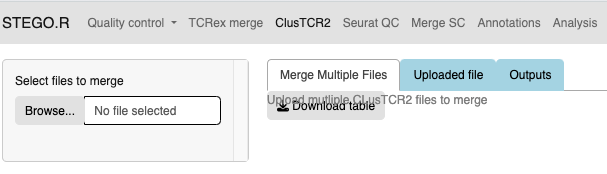

Step 2. TCRex and ClusTCR2
==========================

.. note:: 
    Consideration for the analysis.  
       The pipeline was built for scRNA-seq with scTCR-seq datasets. 

       QC documentation is being actively updated. 

.. note:: 
    Prerequisite
        Install STEGO. 

        Copy all your raw files to the 0_Raw_files folder within your project. 

        Downloaded files to 1_ClusTCR2 and 1_TCRex

**Merging TCRex**
~~~~~~~~~~~~~~~~~~

1. Upload all the files stored in the "1_TCRex" for merging and save the merged file to the 1_TCRex. 
2. The TCRex merge file will be uploaded to the `TCRex website <https://tcrex.biodatamining.be>`_ to predict if the beta chain will interact with certain epitopes.
3. Once the TCRex process is complete, download the processed file, and move it to the **3_Analysis** folder

**Clustering with ClusTCR2**
~~~~~~~~~~~~~~~~~~~~~~~~~~~~
1. If there are multiple files under the 'ClusTCR2', the user will upload all the **AG_** or **BD_** from the **1_ClusTCR2** folder.
      - save the file with **AG_** or **BD_** prefix.

2. Upload either the merged file or single **AG_** or **BD_** under the "Clustering inputs" tab.
3. Hit the "Update clustering" button to perform the clustering. 

4. Under the "output" tab has three sub-sections
      - Processing: Time taken to complete the clustering
      - Table for analysis: Download the table to the "3_Analysis" section; make sure you add the **AG_** or **BD_** prefix to the file name.
      - Figures: The user can explore the data and download the clustering network and the corresponding motif. The latter figure is also generated in the "Analysis section".  

Error issues
~~~~~~~~~~~~

If the file produces a matrix larger than 2^31, the user will need to use the command-line process. 

.. code-block:: language
  require(ClusTCR2)
  clust.data.raw <- read.csv("1_ClusTCR/AG_Multi_ClusTCR.csv")
  names(clust.data.raw)[2]
  step1 <- ClusTCR2::ClusTCR_Large(clust.data.raw,allele = F,v_gene = names(clust.data.raw)[2])
  step2 <- ClusTCR2::mcl_cluster_large(step1)
  saveRDS(step2,"1_ClusTCR/AG_clusTCR2.all.rds") # saves the two list objects
  write.csv(step2[[1]],"AG_clusTCR2.csv",row.names = F)

  clust.data.raw <- read.csv("1_ClusTCR/BD_Multi_ClusTCR.csv")
  names(clust.data.raw)[2]
  step1 <- ClusTCR2::ClusTCR_Large(clust.data.raw,allele = F,v_gene = names(clust.data.raw)[2])
  step2 <- ClusTCR2::mcl_cluster_large(step1)
  saveRDS(step2,"1_ClusTCR/BD_clusTCR2.all.rds") # saves the two list objects
  write.csv(step2[[1]],"3_Analysis/BD_clusTCR2.csv",row.names = F)
