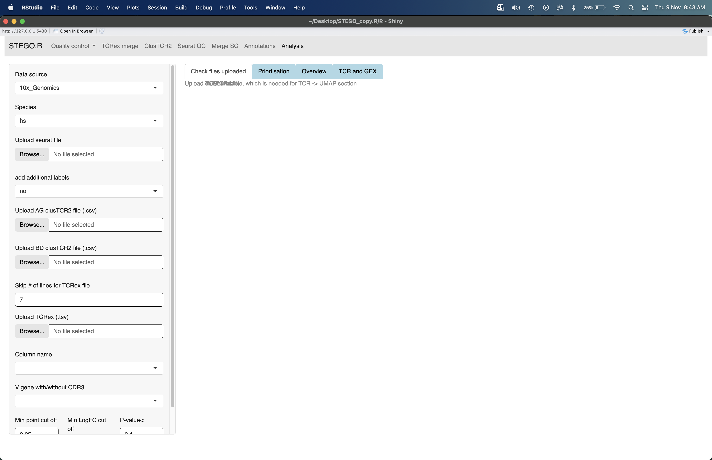

Analysis
========
.. note::

    Under active construction

The analysis section contains three 

The analysis section is divided into several sub-sections. 

- Overview
- TCR and GEX 

*Note: The proritisation pipeline is under active development and will be completed in several stages. The first update will include automated the simple case analyis (one sample), one group (multiple samples) and paired analysis (one group; paired samples) (STEGO.R Version 2). Stage two will add several of the more complex analysis (STEGO.R version 3).*

Uploading the files
-------------------

There first tab will show in the side panel the files that can be uploaded. 

This includes:
- Annotated  object (.h5Seurat)
- Adding in additional identifiers if needed. This file is merged with the meta-data based on the 'Sample_Name'
- Two clusTCR2 files (prefex with AG and BD) (.csv)
- TCRex output file (.tsv)

Overview analysis
-----------------

- Overview
  - GEx
  - TCR-seq
- Differential expression
- GEx + TCR-seq
  - Prioritisation stratergy (under active development)
  - Top clonotype
  - Expanded clones
  - Epitope
  - ClusTCR2
