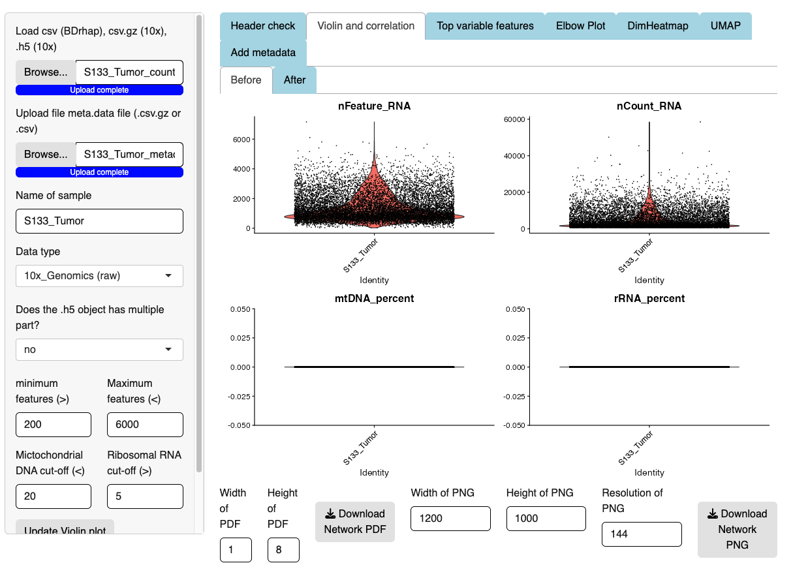
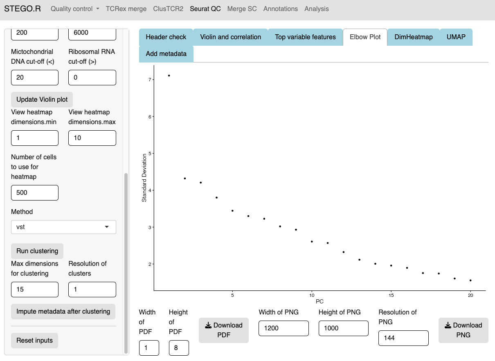
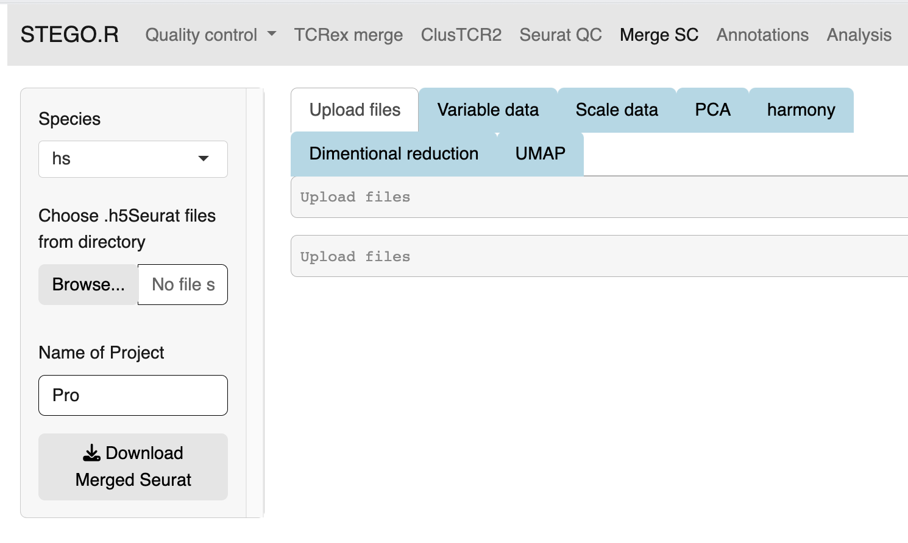

Step 3. Quality control
=======================

.. note:: 
    Consideration for the analysis.  
        Steps 3b and 3c can be done either in the interface or with the command-line code in the "merging.batch.harmony.R" in the project directory.
    Prerequisite
        Completed the step 1. foramtting and have the two files (matrix.csv and meta.data.csv files in the 1_SeuratQC folder) 

**STEP 3a.** Quality control of a Seurat object
~~~~~~~~~~~~~~~~~~~~~~~~~~~~~~~~~~~~~~~~~~~~~~~

This section describes the Seurat QC process for human samples with 10x Genomics. I use the S133 sample from GES145370 dataset for the example screen shots. 

1. Upload both the meta-data.csv file and the matrix file (.csv.gz, .csv or .h5). 
2. Add the file name, which will be identical to the previous file name.
3. Select the data origin, as it will change the cut-off settings.
      - 10x Genomics >6000 features (transcripts per cell), are deemed to be doublets.
      - BD Rhapsody Immune panel > 150 features, are deemed to be doublets.
4.   Check that the file was uploaded
5.   Look at the first volcano plot "before" tab, as we need to check the cut-off for the MtDNA and rDNA cut-offs
      - MtDNA standard cut-off less than 20%
      - rRNA standard cut-off is greater than 5%. If there is no rRNA genes identifed, set value to 0 or the program will crash due to no cell's remaining.

6. Once the settings have been configured, hit update. This will add the File name.
7. The user can then inspect the presence of the top variable features, elbow plot and Heatmaps. The latter two plots are to aid in setting the number of dimentions to use for the UMAP dimentional reduction. Default is set to 15. The resolutions are used for the unsupervised clustering. *Note: I use the scGate for the annotation stratergy rather than the unsupervised clusters as it is not suitable for identifying subtle differences in T cell sub-populations.*

8. In the side panel, hit the "Run clustering" button to run the dimentionality reduction.
9. In the "Add meta data", first check that the file has uploaded correctly.
10. Next, In the side panel hit the "Input metatdata after clustering"
      - This will render a new table, and check that there are TCRs present. 
11. Now your file has completed the Seurat QC and has had the TCR sequences added to the meta-data. click the "Download Seurat" object and save it to the **"2_SCobj"** folder.
 
**STEP 3b.** Merging multiple Seurat objects 
~~~~~~~~~~~~~~~~~~~~~~~~~~~~~~~~~~~~~~~~~~~

This section is to merge multiple .rds objects and correct for the batch effect. 

1. From the **"2_SCobj"** upload all the .rds files.

2. Download the merged.rds object

**STEP 3c.**  
~~~~~~~~~~~~~~~~~~~~~~~~~~~~~~~~~~~~~~~~~~~

2. Wait for the files to finish uploading before proceeding 
3. Update the Project name e.g., BreastCancer
4. Hit the bottons in each tab in the following order:
    - Run VariableFeatures
    - Run Scale
    - Run PCA
    - Run Harmony *Note: Harmony R package is used for the batch correction.*
    - Run Dimentional Reduction

5. Once completed click the "Download merged Seurat"

*Note: Depending on the number of files, and total number of cells will impact the speed of merging*

**WARNING** This section may not run on Windows. 

**Step 3d.** Annotating the Seurat object
~~~~~~~~~~~~~~~~~~~~~~~~~~~~~~~~~~~~~~~

This section describes how to annotated the files either from the "default" and/or "custom" modules with scGate. 

Also, there is a "TCR" annotation section that identifies the human unconventional T cells: MAIT, iNKT, gamma-delta T cells, and possible CD1c-restricted (mouse is under development). 

Default annotation models with scGate
^^^^^^^^^^^^^^^^^^^^^^^^^^^^^^^^^^^^^

*Note: Under development.*

The scGate threshold was set to 0.2 for full capture and 0.5 for the immune panel (<400 transcripts). 

* **10X Genomics for human**

* **10X Genomcis for Mouse** (*Will likely be the same as the BD Rhapsody mouse full panel model.*)

* **BD Rhapsody Human immune panel**

+----------+-------------------------+-----------------------------------------------------------------------------------------------------+
| Cell type|Sub-classification	     | Transcriptional markers                                                                             |
+==========+=========================+=====================================================================================================+
| CD4        |  CD4                  |CD8A-, CD8B-, CD4, Cyto-, FOXP3-, RORC-, CCR4-, IL21-, CCR10-, IRF4-, CXCR3-, Naive, KLRB1-, FTH1-   |
+            +-----------------------+-----------------------------------------------------------------------------------------------------+
|            | CD161                 |CD8A-, CD8B-, CD4, Cyto-, FOXP3-, RORC-, CCR4-, IL21-, CCR10-, IRF4-, CXCR3-, Naive, KLRB1, IL32-    |
+            +-----------------------+-----------------------------------------------------------------------------------------------------+
|            | CD161.IL32            |CD8A-, CD8B-, CD4, Cyto-, FOXP3-, RORC-, CCR4-, IL21-, CCR10-, IRF4-, CXCR3-, Naive, KLRB1, IL32     |
+            +-----------------------+-----------------------------------------------------------------------------------------------------+
|            |Eff                    |CD8A-, CD8B-, CD4, Cyto, RORC-, CXCR3-                                                               |
+            +-----------------------+-----------------------------------------------------------------------------------------------------+
|            |Eff.Th1                |CD8A-, CD8B-, CD4, Cyto, RORC-, CXCR3                                                                |
+            +-----------------------+-----------------------------------------------------------------------------------------------------+
|            |Eff.Th17	             |CD8A-, CD8B-, CD4, Cyto, RORC                                                                        |
+            +-----------------------+-----------------------------------------------------------------------------------------------------+
|            |FTH1                   |CD8A-, CD8B-, CD4, Cyto-, FOXP3-, RORC-, CCR4-, IL21-, CCR10-, IRF4-, CXCR3-, Naive, KLRB1-, FTH1    |
+            +-----------------------+-----------------------------------------------------------------------------------------------------+
|            |Naive	                 |CD8A-, CD8B-, CD4, Cyto-, FOXP3-, RORC-, CCR4-, IL21-, CCR10-, IRF4-, CXCR3-, Naive                  |
+            +-----------------------+-----------------------------------------------------------------------------------------------------+
|            |Tfh                    |	CD8A-, CD8B-, CD4, Cyto-, FOXP3-, RORC-, CCR4-, IL21                                               |
+            +-----------------------+-----------------------------------------------------------------------------------------------------+
|            |Th1                    | CD8A-, CD8B-, CD4, Cyto-, FOXP3-, RORC-, CCR4-, IL21-, CCR10-, IRF4-, CXCR3                         |
+            +-----------------------+-----------------------------------------------------------------------------------------------------+
|            |Th17                   |	CD8A-, CD8B-, CD4, Cyto-, FOXP3-, RORC                                                             |
+            +-----------------------+-----------------------------------------------------------------------------------------------------+
|            |Th2                    |	CD8A-, CD8B-, CD4, Cyto-, FOXP3-, RORC-, CCR4                                                      |
+            +-----------------------+-----------------------------------------------------------------------------------------------------+
|            |Th22                   |	CD8A-, CD8B-, CD4, Cyto-, FOXP3-, RORC-, CCR4-, IL21-, CCR10                                       |
+            +-----------------------+-----------------------------------------------------------------------------------------------------+
|            |Th9                    |	CD8A-, CD8B-, CD4, Cyto-, FOXP3-, RORC-, CCR4-, IL21-, CCR10-, IRF4                                |
+            +-----------------------+-----------------------------------------------------------------------------------------------------+
|            |Treg	                 |CD8A-, CD8B-, CD4, Cyto-, FOXP3                                                                      |
+------------+-----------------------+-----------------------------------------------------------------------------------------------------+
|CD8aa       |CD8aa                  |	CD8A, CD8B-, Cyto-, FOXP3-, KIR2DL1-, Naïve-, FTH1-                                                |
+            +-----------------------+-----------------------------------------------------------------------------------------------------+
|            |Eff                    |	CD8A, CD8B-, Cyto, KIR2DL1-                                                                        |
+            +-----------------------+-----------------------------------------------------------------------------------------------------+
|            |Eff.KIR	             |CD8A, CD8B-, Cyto, KIR2DL1                                                                           |
+            +-----------------------+-----------------------------------------------------------------------------------------------------+
|            |FTH1	                 |CD8A, CD8B-, Cyto-, FOXP3-, KIR2DL1-, Naïve-, FTH1                                                   |
+            +-----------------------+-----------------------------------------------------------------------------------------------------+
|            |KIR                    |	CD8A, CD8B-, Cyto-, FOXP3-, KIR2DL1                                                                |
+            +-----------------------+-----------------------------------------------------------------------------------------------------+
|            |Naive	                 | CD8A, CD8B-, Cyto-, FOXP3-, KIR2DL1-,Naive                                                          |
+            +-----------------------+-----------------------------------------------------------------------------------------------------+
|            |Treg	                 |CD8A, CD8B-, Cyto-, FOXP3                                                                            |
+------------+-----------------------+-----------------------------------------------------------------------------------------------------+
| CD8ab      |  CD8ab                |CD8A, CD8B, Cyto-, FOXP3-, KIR2DL1, RORC-, CCR4-, CCR10-, IRF4-, CXCR3-, Naive-, KLRK1-              |
+            +-----------------------+-----------------------------------------------------------------------------------------------------+
|            |Eff            	     | CD8A, CD8B, Cyto, RORC-, CCR4-, CCR10-, IRF4-, CXCR3-                                               |
+            +-----------------------+-----------------------------------------------------------------------------------------------------+
|            |Eff.Tc1                |	CD8A, CD8B, Cyto, RORC-, CCR4-, CCR10-, IRF4-, CXCR3                                               |
+            +-----------------------+-----------------------------------------------------------------------------------------------------+
|            |Eff.Tc2                |	CD8A, CD8B, Cyto, RORC-, CCR4                                                                      |
+            +-----------------------+-----------------------------------------------------------------------------------------------------+
|            |Eff.Tc22               |	CD8A, CD8B, Cyto, RORC-, CCR4-, CCR10                                                              |
+            +-----------------------+-----------------------------------------------------------------------------------------------------+
|            |Eff.Tc9                |	CD8A, CD8B, Cyto, RORC-, CCR4-, CCR10-, IRF4                                                       |
+            +-----------------------+-----------------------------------------------------------------------------------------------------+
|            |Eff.Tc17               |	CD8A, CD8B, Cyto, RORC                                                                             |
+            +-----------------------+-----------------------------------------------------------------------------------------------------+
|            |KIR                    |	CD8A, CD8B, Cyto-, FOXP3-, KIR2DL1                                                                 |
+            +-----------------------+-----------------------------------------------------------------------------------------------------+
|            |Naive	                 |CD8A, CD8B, Cyto-, FOXP3-, KIR2DL1-, RORC-, CCR4-, CCR10-, IRF4-, CXCR3-, Naive                      |
+            +-----------------------+-----------------------------------------------------------------------------------------------------+
|            |NKG2D	                 |CD8A, CD8B, Cyto-, FOXP3-, KIR2DL1-, RORC-, CCR4-, CCR10-, IRF4-, CXCR3-, Naive-, KLRK1              |
+            +-----------------------+-----------------------------------------------------------------------------------------------------+
|            |Tc1	                 |CD8A, CD8B, Cyto-, FOXP3-, KIR2DL1-, RORC-, CCR4-, CCR10-, IRF4-, CXCR3                              |
+            +-----------------------+-----------------------------------------------------------------------------------------------------+
|            |Tc17	                 |CD8A, CD8B, Cyto-, FOXP3-, KIR2DL1-, RORC                                                            |
+            +-----------------------+-----------------------------------------------------------------------------------------------------+
|            |Tc2	                 |CD8A, CD8B, Cyto-, FOXP3-, KIR2DL1-, RORC-, CCR4                                                     | 
+            +-----------------------+-----------------------------------------------------------------------------------------------------+
|            |Tc22	                 |CD8A, CD8B, Cyto-, FOXP3-, KIR2DL1-, RORC-, CCR4-, CCR10                                             |
+            +-----------------------+-----------------------------------------------------------------------------------------------------+
|            |Tc9	                 |CD8A, CD8B, Cyto-, FOXP3-, KIR2DL1-, RORC-, CCR4-, CCR10-, IRF4                                      |
+            +-----------------------+-----------------------------------------------------------------------------------------------------+
|            |Treg	                 |CD8A, CD8B, Cyto-, FOXP3                                                                             |
+------------+-----------------------+-----------------------------------------------------------------------------------------------------+
|DN          |DN	                 |CD8A-, CD8B-, CD4-, Cyto-, FOXP3-, RORC-, CCR4-, IL21-, CCR10-, IRF4-, CXCR3-, Naive-, FTH1-         |
+            +-----------------------+-----------------------------------------------------------------------------------------------------+
|            |Eff	                 |CD8A-, CD8B-, CD4-, Cyto                                                                             |
+            +-----------------------+-----------------------------------------------------------------------------------------------------+
|            |FTH1	                 |CD8A-, CD8B-, CD4-, Cyto-, FOXP3-, RORC-, CCR4-, IL21-, CCR10-, IRF4-, CXCR3-, Naive-, FTH1          |
+            +-----------------------+-----------------------------------------------------------------------------------------------------+
|            |Naive	                 |CD8A-, CD8B-, CD4-, Cyto-, FOXP3-, RORC-, CCR4-, IL21-, CCR10-, IRF4-, CXCR3-, Naive                 |
+            +-----------------------+-----------------------------------------------------------------------------------------------------+
|            |Tfh	                 |CD8A-, CD8B-, CD4-, Cyto-, FOXP3-, RORC-, CCR4-, IL21                                                |
+            +-----------------------+-----------------------------------------------------------------------------------------------------+
|            |Th1	                 |CD8A-, CD8B-, CD4-, Cyto-, FOXP3-, RORC-, CCR4-, IL21-, CCR10-, IRF4-, CXCR3                         |
+            +-----------------------+-----------------------------------------------------------------------------------------------------+
|            |Th17	                 |CD8A-, CD8B-, CD4-, Cyto-, FOXP3-, RORC                                                              |
+            +-----------------------+-----------------------------------------------------------------------------------------------------+
|            |Th2	                 |CD8A-, CD8B-, CD4-, Cyto-, FOXP3-, RORC-, CCR4                                                       |
+            +-----------------------+-----------------------------------------------------------------------------------------------------+
|            |Th22	                 |CD8A-, CD8B-, CD4-, Cyto-, FOXP3-, RORC-, CCR4-, IL21-, CCR10                                        |
+            +-----------------------+-----------------------------------------------------------------------------------------------------+
|            |Th9	                 |CD8A-, CD8B-, CD4-, Cyto-, FOXP3-, RORC-, CCR4-, IL21-, CCR10-, IRF4                                 |
+            +-----------------------+-----------------------------------------------------------------------------------------------------+
|            |Treg	                 |CD8A-, CD8B-, CD4-, Cyto-, FOXP3                                                                     |
+------------+-----------------------+-----------------------------------------------------------------------------------------------------+

* **Mouse Panel** Under development

TCR annotations
^^^^^^^^^^^^^^^

This section, which currently is annotated separately from the scGate

Creating custom annotation stratergies
^^^^^^^^^^^^^^^^^^^^^^^^^^^^^^^^^^^^^^

*Note: section is incomplete.*

There are nine custom databases that a user can amend. If needed, these can be added to an already annotated file.

**Design your custom marker set**

Check that the cells express the markers under the "marker check" tab.
    - To run, click the 'View Feature plot'
    - The user can alter the range to a custom 

If needed, you can use either the "Treatment differences within cluster" or "cluster difference" to have better identification of marker differneces between clusters.

