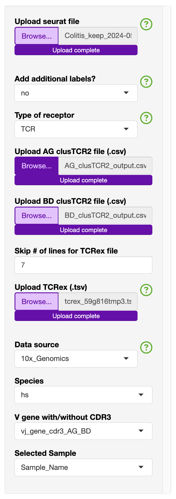
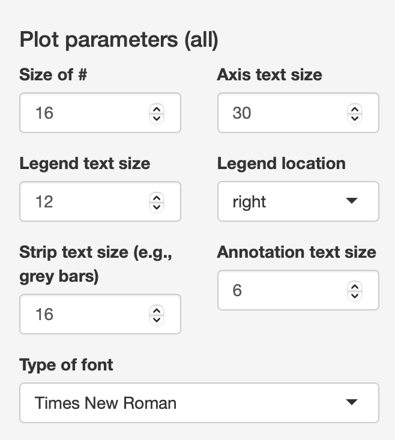

Step 4. Analysis
================
.. note::

    Under active construction
    
    This section will include example analyses depending on the type of data present.

Application structure
---------------------
The analysis section is divided into several sub-sections. 

- Uploaded files
- Overview 
- TCR -> GEX 
- Automation (TCR -> GEx)
- GEx -> TCR

Uploaded files
--------------

There first tab will show in the side panel the files that can be uploaded. 

Side bar
^^^^^^^^

To streamline the analysis, for this section you will only see the following:

.. image:: img/4_files_to_upload.png
  :width: 400
  :alt: Alternative text

This will include the following default files that can be uploaded: 
- Upload seurat file (.rds)
- Upload AG clusTCR2 file (.csv)
- Upload BD clusTCR2 file (.csv)
- Upload TCRex (.tsv)

To make selecting the "**Data source**" and "**Species**", there are functions to identify if the TCR-seq formattting is AIRR or not. The species is currently either human (hs) or mouse (mm) and based on the gene formatting of all caps (hs) or proper case (mm). The latter is needed as R is a case sensative language. 

If you need additional identifiers for the analysis section, this can be added by switching "add additional labels" to "yes" and upload the "Upload_labels.csv". 

.. csv-table:: table
    :header-rows: 1
    :file: path/Update_labels.csv
    :widths: 40, 40, 40
    :class: longtable

Main panel 
^^^^^^^^^^

Depending on what you have uploaded, the main panel will render several tables. The first table is of the Seurat object's meta-data and you will see how it adds the additional labels after the "Sample_Name" column. 

Uploaded example K409 Melanoma dataset

Variable used for all analysis in the side bar
----------------------------------------------

These drop down menues allow the user to change what is presented on the graphs and the analysis

The selected individuals = Sample Name (default)

Display by Selected Individual = no or yes. This is linked to the "Selected Individual" button. 

Number of plot row  = 2. This allows the user to select the number of rows to display as desired.

The "Split graph by:" button allows for some graphs e.g., Pie charts, to be split by this variable rather than the "Selected Individual"

.. image:: img/4_display-graph.png
  :width: 300
  :alt: Alternative text

The user can also select which variable to colour the graphs by with "Colour by:" 

Additionally, the uder can also select the colouring Palettes that includes: "default", "rainbow", "random", "heat.colors", "terrain.colors", "topo.colors", "hcl.colors", "one"

The "one" colour is linked to the "One colour". Additionally all NA variable will be coloured the light grey #E5E5E5

.. image:: img/4_colouring_buttons.png
  :alt: Alternative text
  :width: 200

For some of the functions, the user can restrict to "What individuals to include"

This includes both the 
- "Display one individual?"
- "Display one individual"

For instance this is used to filter the TCR table in the clonal abudance section to more easily identify the most abundant cloens relative to a specific sample/individual based on the "selected individuals" button. 

.. image:: img/4_What_individuals_to_include.png
  :width: 200
  :alt: Alternative text

The user can also select the plot parameters that are relevant to the majority of the graphs

This includes:
    - Axis number size - size of the numbered axis
    - Axis text size i.e., axis title
    - Legend text size
    - legend location (left, right, top, bottom or none)
    - Type of Font 

Overview
^^^^^^^^
- GEx
    - Percentage (Table)
    - UMAP of the annotation models
    - Pie chart
- TCR
    - UPSET plot (<31)
    - Line graph (clone tracking)
    - expansion (bar) 
    - expansion (UMAP)

TCR-seq -> GEX
^^^^^^^^^^^^^^^^

Each section has a summary table, UMAP, Heatmap, stats, dot-plot and over-representation.

Some of the secions also have unique features.

- Clonal abudance
    - Bar graph 
    - Ridge and Violin plots (for a specific gene)
- Exapanded
- ClusTCR
    - Motif 
- Epitope 
    - Load Epitope list 

Automation (TCR -> GEX)
^^^^^^^^^^^^^^^^^^^^^^^^^^^^^^^^

- Clonotype 
    - Download public (bar graphs), summary table, dot plot for each public-like clone
    - Download private (single sample)
    - Can restrict based on the calculated priority 1/(sample total * total count)
    
- Cluster 
    - Download the motif, summary table, dot plot for each public-like and private clusters
        - A common cluster is TRAV1-2 TRAJ33 
        - separate alpha and beta cut-offs
    - Priority: 1/(number of nodes * sample total * total count)

- Epitope/Annotation
    - with the epitopes find the associated epitopes from TCRex 
    - Unselect "Add in Epitope data" to focus on the annotations. So, you can identify the TCR linked to specific annotation models (e.g., FunctionTcell)

GEx -> TCR
^^^^^^^^^^^^^^^^

- Annotation
    - Under development 

- Marker 
    - Single marker
    - Dual marker 

Example 1. Colitis dataset
--------------------------

In the zenodo repository we have uploaded the colitis dataset. This consis of 32 samples in the colitis dataset with the additon of the background data. 

